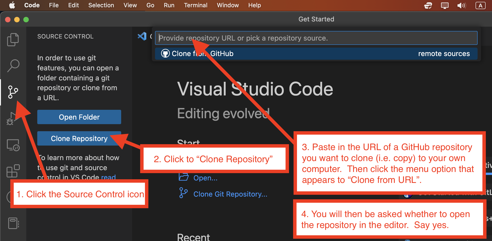

# Project Proposal

Write a proposal for a mobile web application you would like to pursue for the majority of the semester into the file named `README.md`. Make your project idea obvious, interesting, and make the need for it sound convincing.

## Collaboration

You are welcome to work in a team of up to 5 people on this proposal, if desired. If you do work with others on the proposal, you **must** clearly indicate the names of all the team members in your proposal, where the names link to their GitHub user profiles.

## Editing files in this repository

This repository has presumably been created for you on GitHub.com. To download a copy of this repository onto your own computer so you can edit it, you will need to use **git** to `clone` it to your own computer. Once cloned, you can use a code editor to edit the files in the repository. Once done editing, you will need to use **git** again to `add` your changes, `commit` them, and then `push` them back to GitHub. Any good code editor should allow you to do the git operations by clicking buttons in the interface.

To `clone` a GitHub repository in Visual Studio Code:

Then use the editor to make changes.

To `add`, `commit`, and `push` the changes you have made back to GitHub:

## What edits to include

Your proposal must focus on the product's value proposition, including answers to the questions below. Keep it thorough but concise. If you are not clear on whether your writing is any good, consult with a friend.

### Project title

Give your project a nice title.

### What and why?

What software system would you like to build this semester, and why? Include a description of what problem the system would solve and why this is important.

### For whom?

Who will this software be for? These people are your end-users or customers.

Do not make software for imaginary users who do not exist - you must have real people as your initial end-users. Tell us who they are. For example, is it for a particular type of business, mass consumer, a campus office, a professor, or friends or family, or ... people just like you.

Understanding who your end-users are, and ideally speaking with some along the way, will help you refine your designs to be suitable for your audience, and understand whether you have succeeded at the end or not.

### How?

A description of what the system will do from an end-user's perspective. Be as complete as necessary to fully explain the system, but do not worry about technical implementation - this will be developed in subsequent work.

### Scope

A brief justification that the proposal is neither too easy nor too ambitions for a group of approximately 4 - 6 programmers to undertake in one semester.

## Submission

Complete the assignment as a Markdown document in the file named `README.md` in this repository. The document should be nicely formatted and outlined with a clear heading and sub-headings for each section.

Use the `git` features of **Visual Studio Code** to commit your work and `push` them to the GitHub repository.

Share the link to your document in your private assignments Discord channel AND in the public `#project-ideas` channel. In both cases, include the title of your project for all to see in the message.

## What happens next

We will select a subset of the proposals that we think will be the most interesting and appropriate for this course. These will be published to the class. Your next assignment will be to rank your favorites. We will then make team assignments based on this information and the answers you have provided to the previous introductory questionnaire.

If your proposal is selected, you are 99% guaranteed to be part of that team.
